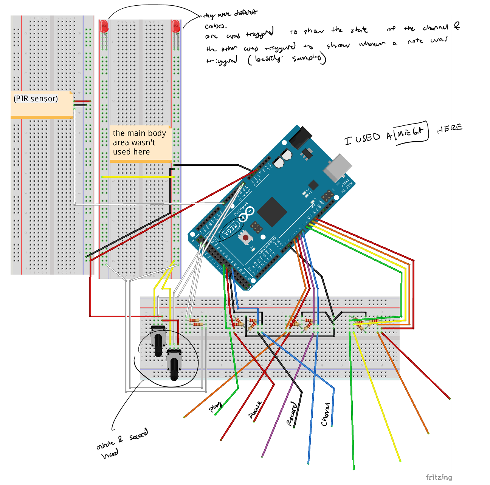
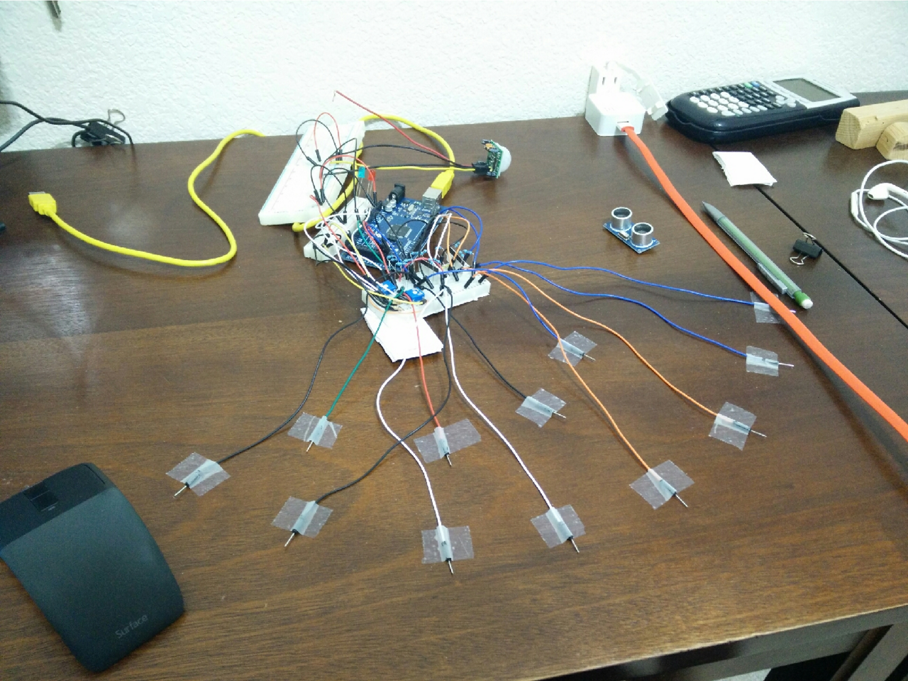
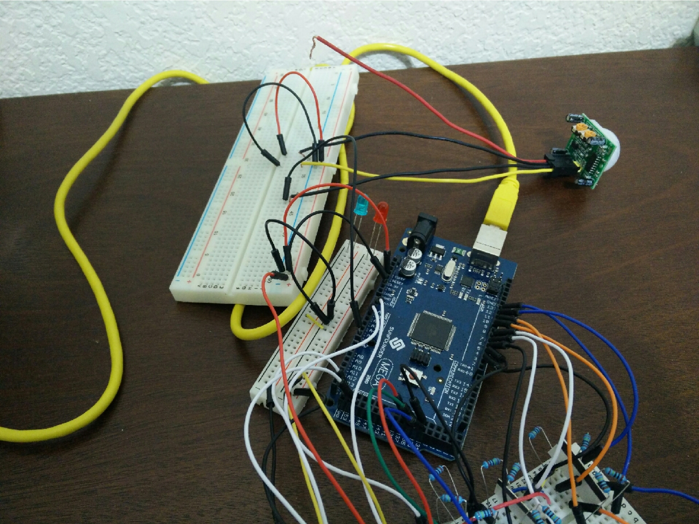

# mega_sketch
This was a super big arduino project that mashed two different kinds of MIDI controllers together. One made from a potentiometer clock and one from a capacitor keyboard.
## notes:
This one took a lot more effort to do. The first issue I had was getting the clocks to move the potentiometers. Since the hands aren’t solidly attached to the axles, I tried to glue them down to the axels but it never worked. I tried clamping the grove of the second hand down with glue onto the axle but that didn't work either ( however it worked for a day ), and I even tried burning the groove of the axle with a candle but it turns out that the groove was made of plastic so I could've easily broken it by trying to bend it with the nail clippers too. I almost gave up several times, and I stepped on a pane of glass on my way into my room breaking it. Fortunately, Everything worked out fine. The potentiomters can move relatively smoothly (except the minute hand, but that's understandable), but I started to not want to code anymore. My code became so long that whenever I wanted to make a tweak to make the code cooler, I just didn't want to do it because I knew how much effort it'd take. Much of this dislike for coding probably came from my terrible organization, my lack of creating new methods, and my lack of creating constants when needed ( I dropped a lot of magic numbers )

below are some images

  
  

  
  

